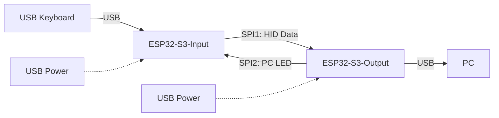

# Physical HID Macro with USB Passthrough

An ESP32 USB HID Passthrough for Keyboard and Mouse. Allowing macro injection.

> ⚠️ **Mouse is progress!** .. only keyboard is available currently.

---

- ⏰: With a focus on low latency. You can expect sub-millisecond latency added by the passthrough.
- ⌨️ / 🖱️: Compatible for peripheral up to 1000Hz of pooling rate.
- 🕹️: Expected to works fine for gaming.

## Overview

**macroPassthrough** is a dual-ESP32-S3 project that enables USB keyboard passthrough and macro injection. It acts as a bridge between a USB keyboard and a PC, allowing for the interception and injection of custom keyboard macros. The project is designed for advanced keyboard automation, security research, and prototyping custom HID devices.

---

## Inspiration

This project is inspired by the following examples:
- [ESP-IDF USB Device TinyUSB HID Example](https://github.com/espressif/esp-idf/tree/master/examples/peripherals/usb/device/tusb_hid)
- [ESP-IDF USB Host HID Example](https://github.com/espressif/esp-idf/tree/master/examples/peripherals/usb/host/hid)
- [TinyUSB Host Device Info Example](https://github.com/hathach/tinyusb/tree/0.19.0/examples/host/device_info)

---

## Project Structure

- **usb-input/**  
  ESP32 firmware that acts as a USB host, receives HID reports from a keyboard, and forwards them over SPI.

- **usb-input-tinyusb/** *(⚠️ work in progress)*  
  Alternative input firmware using the TinyUSB stack for USB host functionality. Use this if you prefer TinyUSB over the ESP-IDF USB host stack.

- **usb-output/**  
  ESP32 firmware that acts as a USB device, receives HID/macro reports over SPI, aggregates them, and presents as a USB HID keyboard to the PC. Supports macro injection.

- **benchmark/**  
  Contains performance and latency measurement data for different USB and SPI configurations.

---

## System Architecture



**Legend:**
- **USB Keyboard**: The physical keyboard connected to the input ESP32-S3.
- **ESP32-S3-Input**: Runs usb-input or usb-input-tinyusb firmware, acts as USB host and SPI master.
- **ESP32-S3-Output**: Runs usb-output firmware, acts as SPI slave and USB device.
- **SPI1: HID Data**: HID reports from input to output.
- **SPI2: PC LED**: Ouput reports coming the PC (Keyboard LED).
- **PC**: Receives HID input as if from a real keyboard.
- **USB Power**: Both ESP32-S3 boards are powered via USB.

---

## Hardware Requirements

- 2 × ESP32-S3 (one for input, one for output): *Only tested with ESP32-S3, but should works fine with ESP32-S2. And with a little works with ESP32-H4.*
- USB keyboard (for passthrough)
- PC (for HID output)
- SPI wiring between the two ESP32 boards
- USB cables for programming and connecting devices

---

## Build Instructions

1. **Set up ESP-IDF**  
   Follow the [ESP-IDF Getting Started Guide](https://docs.espressif.com/projects/esp-idf/en/latest/esp32/get-started/) to install the toolchain and export environment variables.

2. **Clone this repository**  
   ```sh
   git clone https://github.com/arfevrier/macroPassthrough.git
   cd macroPassthrough
   ```

3. **Build the firmware**  
   For each component (e.g., usb-input, usb-output), run:
   ```sh
   cd usb-input
   idf.py build

   cd ../usb-output
   idf.py build
   ```
   For TinyUSB variant:
   ```sh
   cd usb-input-tinyusb
   git clone https://github.com/hathach/tinyusb.git components/tinyusb
   idf.py build
   ```

4. **Flashing**  
   Flash the firmware using the IDF environment. The project have been made using VSCode with ESP-IDF extension.

---

## Usage

1. **Connect the USB keyboard** to the input ESP32 (running usb-input or usb-input-tinyusb).
2. **Connect the output ESP32** to the PC.
3. **Wire the SPI bus** between the two ESP32 boards (refer to `config.h` for pin assignments).
4. **Customize the macro** configuration inside `usb-output/main/config.h`
5. Power both boards and reset if necessary.
6. The PC should recognize the output ESP32 as a USB keyboard. Macros can be injected as configured in the firmware.

---

## Benchmarks

The `benchmark/` directory contains latency and throughput measurements for different configurations (e.g., ESP-IDF USB host, TinyUSB, SPI). See the text files for details.

---

## License

This project is licensed under the terms of the [LICENSE](LICENSE) file.