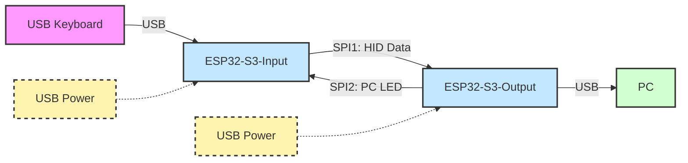

# Physical HID Macro with USB Passthrough

An ESP32 USB HID Passthrough for Keyboard and Mouse. Allowing macro injection.

---

- ⏰: With a focus on low latency. You can expect sub-millisecond latency added by the passthrough.
- ⌨️ / 🖱️: Compatible for peripheral up to 1000Hz of pooling rate.
- 🕹️: Expected to works fine for gaming.
- 🔌: You can connect a USB hub, allowing you to connect both the keyboard and mouse at the same time.

## Overview

**macroPassthrough** is a dual-ESP32-S3 project that enables USB keyboard and mouse passthrough and macro injection. It acts as a bridge between a USB device and a PC, allowing for the interception and injection of custom keyboard macros. The project is designed for advanced keyboard automation, security research, and prototyping custom HID devices.

---

### Pictures

Overview of connections between the two ESP32-S3s:


## Inspiration

This project is inspired by the following examples:
- [ESP-IDF USB Device TinyUSB HID Example](https://github.com/espressif/esp-idf/tree/master/examples/peripherals/usb/device/tusb_hid)
- [ESP-IDF USB Host HID Example](https://github.com/espressif/esp-idf/tree/master/examples/peripherals/usb/host/hid)

---

## Project Structure

- **usb-input/**  
  ESP32 firmware that acts as a USB host, receives HID reports from a keyboard, and forwards them over SPI.

- **usb-output/**  
  ESP32 firmware that acts as a USB device, receives HID/macro reports over SPI, aggregates them, and presents as a USB HID keyboard to the PC. Supports macro injection.

- **benchmark/**  
  Contains performance and latency measurement data for different USB and SPI configurations.

---

## System Architecture



**Legend:**
- **USB Keyboard**: The physical keyboard connected to the input ESP32-S3.
- **ESP32-S3-Input**: Runs usb-input or usb-input-tinyusb firmware, acts as USB host and SPI master.
- **ESP32-S3-Output**: Runs usb-output firmware, acts as SPI slave and USB device.
- **SPI1: HID Data**: HID reports from input to output.
- **SPI2: PC LED**: Ouput reports coming the PC (Keyboard LED).
- **PC**: Receives HID input as if from a real keyboard.
- **USB Power**: Both ESP32-S3 boards are powered via USB.

---

## Hardware Requirements

- 2 × ESP32-S3 (one for input, one for output): *Only tested with ESP32-S3, but should works fine with ESP32-S2. And with a little works with ESP32-H4.*
- USB keyboard (for passthrough)
- PC (for HID output)
- SPI wiring between the two ESP32 boards
- USB cables for programming and connecting devices

---

## Video demonstration

1. A key activation allows you to launch a key sequence. Here, right-clicking the mouse launches a sequence that presses all the keys of the alphabet.


2. The sequence can also be used in video games (here CS2) to perform automatic aim control. *(Inspired by [NoRecoil-CS2](https://github.com/McDaived/NoRecoil-CS2))*


---

## Build Instructions

1. **Set up ESP-IDF**  
   Follow the [ESP-IDF Getting Started Guide](https://docs.espressif.com/projects/esp-idf/en/latest/esp32/get-started/) to install the toolchain and export environment variables.

2. **Clone this repository**  
   ```sh
   git clone https://github.com/arfevrier/macroPassthrough.git
   cd macroPassthrough
   ```

3. **Build the firmware**  
   For each component (e.g., usb-input, usb-output), run:
   ```sh
   cd usb-input
   idf.py build

   cd ../usb-output
   idf.py build
   ```
   For TinyUSB variant:
   ```sh
   cd usb-input-tinyusb
   git clone https://github.com/hathach/tinyusb.git components/tinyusb
   idf.py build
   ```

4. **Flashing**  
   Flash the firmware using the IDF environment. The project have been made using VSCode with ESP-IDF extension.

---

## CI/CD (Automatic Build)

[](https://github.com/arfevrier/macroPassthrough/actions/workflows/idf-usb-input.yml)
[](https://github.com/arfevrier/macroPassthrough/actions/workflows/idf-usb-output.yml)

This project uses **GitHub Actions** for continuous integration. Every push and pull request automatically triggers builds for both the `usb-input` and `usb-output` ESP-IDF firmware projects. The workflows check out the code, set up the ESP-IDF environment, and run `idf.py build` to ensure the firmware compiles successfully.

- **usb-input**: [Workflow file](.github/workflows/idf-usb-input.yml)
- **usb-output**: [Workflow file](.github/workflows/idf-usb-output.yml)

You can view the build status and logs by clicking the badges above.

---

## Usage

1. **Connect the USB keyboard** to the input ESP32 (running usb-input or usb-input-tinyusb).
2. **Connect the output ESP32** to the PC.
3. **Wire the SPI bus** between the two ESP32 boards (refer to `config.h` for pin assignments).
4. **Customize the macro** configuration inside `usb-output/main/config.h`
5. Power both boards and reset if necessary.
6. The PC should recognize the output ESP32 as a USB keyboard. Macros can be injected as configured in the firmware.

---

### Usage details

#### Configuring Macros in `config.h`

Macro sequences are defined in `usb-output/main/config.h` using the `macro_sequence` variable. Each sequence describes a set of HID actions (keyboard or mouse) that can be triggered by a specific key or mouse event.

##### Structure of a Macro Sequence

A macro sequence is defined as an entry in the `group_sequence_t macro_sequence` structure. Each entry has the following fields:

| Parameter         | Type/Example                | Description                                                                 |
|-------------------|----------------------------|-----------------------------------------------------------------------------|
| `.list`           | `{duration, event}` array  | Steps in the sequence: each with a duration (in microseconds) and an event. |
| `.size`           | `int`                      | Number of steps in `.list`.                                                 |
| `.event_press`    | `ONE_KEYBOARD_KEY(...)`    | Key or mouse event that triggers the sequence.                              |
| `.event_release`  | `ONE_KEYBOARD_KEY(...)`    | (Optional) Key or mouse event that triggers on release.                     |
| `.loop`           | `bool` (`true`/`false`)    | (Optional) Whether the sequence repeats while the trigger is held.          |

#### Example: Minimal Macro Sequence

```c
static const group_sequence_t macro_sequence = {
    .list = {
        {
            .list = {
                {1000*1000, ONE_KEYBOARD_KEY(HID_KEY_A)},
                {1000*1000, EMPTY_KEYBOARD},
            },
            .size = 2,
            .event_press = ONE_KEYBOARD_KEY(HID_KEY_B),
        },
    }
};
```
This example triggers a macro that presses "A" for 1 second, then releases it for 1 second, whenever "B" is pressed.

#### Example: Mouse Movement Macro

```c
{
    .list = {
        {3*1000, MOUSE_MOUVEMENT(-2, 0)},
    },
    .size = 1,
    .loop = true,
    .event_press = ONE_KEYBOARD_KEY(HID_KEY_ARROW_LEFT),
},
```
This macro moves the mouse left while the left arrow key is held.

#### How to Add or Modify Sequences

- Edit `usb-output/main/config.h` and locate the `macro_sequence` variable.
- Add or modify entries in the `.list` array to define new macros.
- Each macro can be triggered by a specific key or mouse event.
- Use the provided macros like `ONE_KEYBOARD_KEY`, `ONE_MOUSE_KEY`, `MOUSE_MOUVEMENT`, and `EMPTY_KEYBOARD` to define actions.

---

#### Using a Custom Configuration File (`config_custom.h`)

For advanced personalization, you can use a custom configuration file to override the default macro settings without modifying the main `config.h`. 

- In `usb-output/main/config.h`, set:
  ```c
  #define CUSTOM_CONFIG 1
  ```
- When `CUSTOM_CONFIG` is set to 1, the firmware will include and use `usb-output/main/config_custom.h` instead of the default macro configuration.
- Create your own `usb-output/main/config_custom.h` file. You can define your own `macro_sequence` or other configuration parameters here.

**Example `usb-output/main/config_custom.h`:**
```c
#pragma once
#include "macpass_macro.h"

static const group_sequence_t macro_sequence = {
    .list = {
        {
            .list = {
                {500*1000, ONE_KEYBOARD_KEY(HID_KEY_X)},
                {500*1000, EMPTY_KEYBOARD},
            },
            .size = 2,
            .event_press = ONE_KEYBOARD_KEY(HID_KEY_Y),
        },
    }
};
```

This approach allows you to keep your personal configuration separate from the main codebase, making it easier to update or share the project without losing your custom settings.

---

#### Custom Macro Hooks in `macpass_macro.c`

For advanced customization, you can add your own logic to modify HID reports before or after they are sent to the PC. This is done by editing the hook functions in `usb-output/main/macpass_macro.c`:

- **`macro_prehook_transmission(hid_transmit_t* report)`**: Called before a HID report is sent. Return `true` to block the report, or modify the report in-place.
- **`macro_posthook_transmission(hid_transmit_t* report)`**: Called after a HID report is sent. Can be used for logging or triggering additional actions.

#### Example: Custom Prehook

```c
bool macro_prehook_transmission(hid_transmit_t* report){
    // Block both A and D from being pressed at the same time
    if (report->header == HEADER_HID_KEYBOARD){
        if (keycode_contains_key(report->event.keyboard, HID_KEY_A) &&
            keycode_contains_key(report->event.keyboard, HID_KEY_D)){
            remove_keycode(&report->event.keyboard, HID_KEY_A);
        }
    }
    return false; // Return true to block the report entirely
}
```

#### Example: Custom Posthook

```c
void macro_posthook_transmission(hid_transmit_t* report){
    // Example: Log every time a macro is triggered
    #if DEBUG_LOG
    ESP_LOGI(pcTaskGetName(NULL), "Macro triggered!");
    #endif
}
```

To add your own logic, simply edit the code between the `// --- START USER CUSTOM MACRO` and `// --- END` comments in the respective functions.

---

## Benchmarks

The `benchmark/` directory contains latency and throughput measurements for different configurations (e.g., ESP-IDF USB host, TinyUSB, SPI). See the text files for details.

---

## License

This project is licensed under the terms of the [LICENSE](LICENSE) file.
